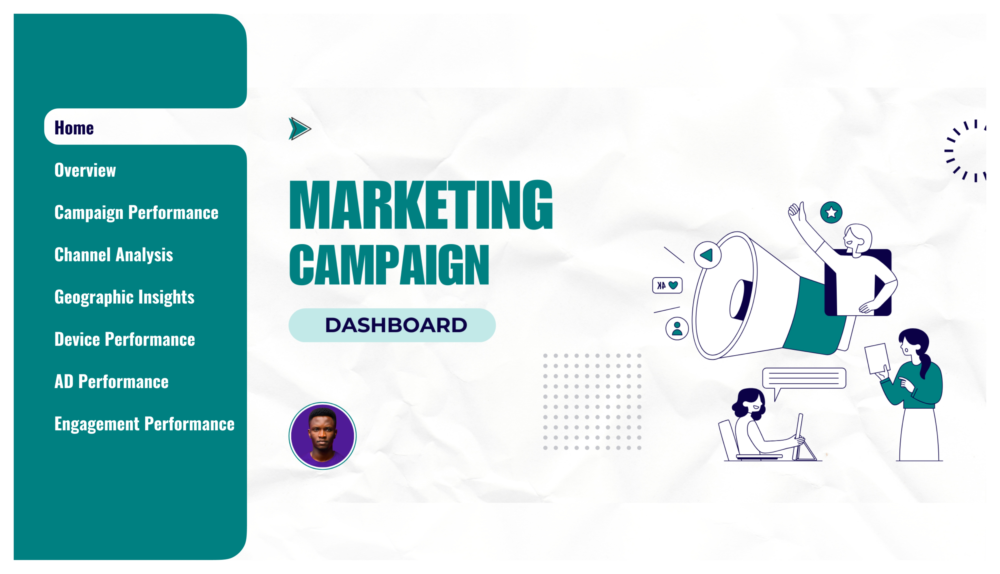

# Marketing Campaign Performance Analysis

## Introduction
This Power BI project analyzes marketing campaign performance metrics across various dimensions including seasons, channels, devices, geographic locations, and ad performance. The analysis aims to optimize campaign effectiveness and drive data-driven marketing decisions.

**_Disclaimer_**: _The data used in this report is from the ONYX Data Archive and is intended solely for demonstration and educational purposes._

## Problems Identified
- Inconsistent performance across campaigns and channels
- Suboptimal conversion rates in specific channels
- High cost-per-click affecting campaign profitability
- Variable engagement metrics across platforms
- Need for better understanding of success factors

## Skills Demonstrated
- Excel
- SQL for data preprocessing and cleaning
- Power BI for visualization and analysis
- DAX for advanced calculations
- Statistical Analysis
- Data Cleaning and Transformation
- Performance Evaluation
- Campaign ROI Analysis
- Geographic Analysis
- Page Navigation
- Interactive Filtering
- Custom Tooltips
- Button Implementation

## Data Preparation
### Data Cleaning Process
The data underwent rigorous cleaning and transformation in Microsoft SQL Server, including:
- Column selection and formatting
- Data type standardization
- NULL value analysis
- Quality assurance checks

**For detailed information on the data cleaning process and data quality tests performed, please refer to the following folder:**
- SQL Scripts

### Data Quality Tests Performed
1. Record count validation (9,900 rows)
2. Column count verification (18 columns)
3. Data type consistency checks
4. Range validation for metrics (CTR, Lat/Long)
5. Data integrity verification

## Project Overview
**Key Performance Indicators (KPIs)**:
- Total Revenue: £1.73M in campaign value
- Total Conversions: 40K successful campaign conversions
- Total Impressions: 14.65M views across platforms
- Total Clicks: 182K user engagements
- Overall ROI: £9.61 return on investment

**Modeling:**

The dataset now follows a star schema model to facilitate efficient performance analysis across multiple dimensions. The fact table contains core transactional data, while the date table enables time-based analysis and simplifies filtering by date-related fields

## Dashboard Pages
1. **Home**: Project overview and navigation
2. **Overview**: High-level performance metrics
3. **Campaign Performance**: Detailed campaign analysis
4. **Channel Analysis**: Channel-specific metrics
5. **Demographic Insights**: Geographic performance analysis
6. **Device Performance**: Device-based analysis
7. **Ad Performance**: Individual ad metrics
8. **Engagement Performance**: Social media engagement analysis

## Analysis
1. **Overview**: Seasonal performance analysis
   - Summer led revenue generation (£166,387.28 peak in July)
   - Fall dominated impressions (2.1M+ in November)

2. **Campaign Performance**
   - Instagram: 15,590 conversions
   - Facebook: 13,132 conversions
   - Pinterest: 11,530 conversions
   - Platform-specific CPC analysis

3. **Channel Analysis**
   - Pinterest showed highest ROI (£21.51)
   - Facebook led impressions (5.44M)
   - Instagram demonstrated optimal conversion performance

4. **Geographic Insights**
   - Manchester: 14,374 conversions
   - Birmingham: 12,798 conversions (0.29 conversion rate)
   - London: 13,080 conversions (5.67M impressions)

5. **Device Performance**
   - Desktop: 21,310 conversions (£949,684.24 revenue)
   - Mobile: Higher clicks (92,766) but lower conversion rate

6. **Ad Performance**
   - "Discount" ad: 21,183 conversions (£1,074,061.43 revenue)
   - "Collection" ad: 105,960 clicks but lower conversion rate

7. **Engagement Performance**
   - Peak engagement: October (36,625 engagements)
   - Consistent engagement rate: 0.05 across peak months

## Recommendations & Action Plan

### 1. Channel Optimization Strategy
**Action Items:**
- Increase budget allocation to Pinterest due to highest ROI (£21.51)
- Optimize Instagram campaigns for conversion focus
- Leverage Facebook's high impression rate with improved targeting
**Timeline:** Next quarter implementation
**Expected Outcome:** 15-20% increase in overall ROI

### 2. Device-Specific Enhancements
**Action Items:**
- Prioritize desktop experience optimization
- Implement mobile-specific conversion rate optimization
- Develop device-targeted ad content
**Timeline:** 30-day implementation plan
**Expected Outcome:** 20% improvement in mobile conversion rates

### 3. Seasonal Campaign Planning
**Action Items:**
- Concentrate budget allocation during summer months
- Develop fall-specific engagement strategies
- Create season-specific ad content
**Timeline:** Implement for upcoming seasonal transitions
**Expected Outcome:** 25% increase in seasonal revenue

### 4. Geographic Focus Enhancement
**Action Items:**
- Increase investment in Manchester and Birmingham
- Optimize London campaigns for conversion improvement
- Develop city-specific targeting strategies
**Timeline:** Immediate rollout over 60 days
**Expected Outcome:** 30% increase in targeted city conversion rates

## Link to Dashboard
Explore the full interactive dashboard [here](https://app.powerbi.com/view?r=eyJrIjoiYWIzMGE0NTItMTkxMy00MzhkLWJmNWItMzhmNzI2MTg1OTdhIiwidCI6IjUxN2QzNTAyLTI5MDEtNGRlMi1hODdiLTk1YzUwN2E5YTA4OCJ9)

## Conclusion
The analysis reveals significant opportunities for campaign optimization across channels, devices, and geographic locations. By implementing the recommended action plan, we can expect improved campaign performance and ROI. Key focus areas should be:
- Leveraging Pinterest's high ROI potential
- Optimizing desktop conversion paths
- Capitalizing on summer campaign effectiveness
- Focusing on high-performing geographic locations
---
